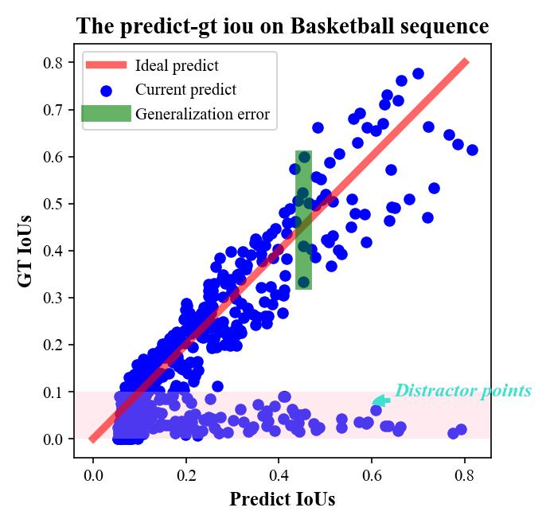
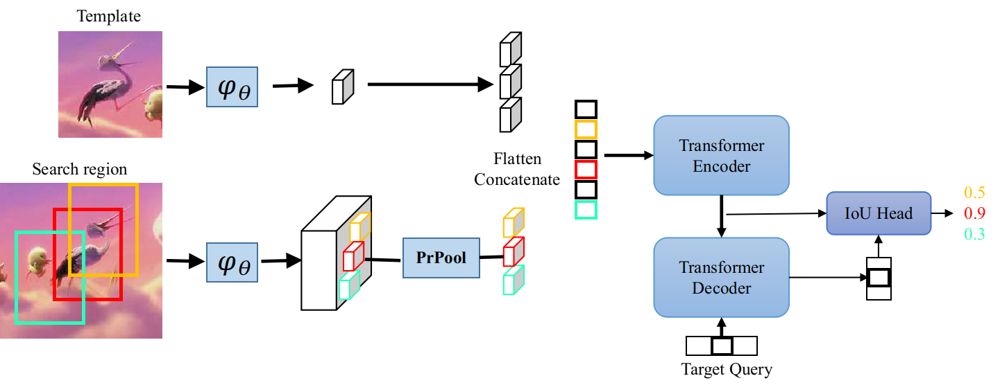

# IoUformer: Pseudo-IoU prediction with transformer for visual tracking

[](https://www.sciencedirect.com/science/article/pii/S0893608024000216)

This is the official implementation of the paper **"IoUformer: Pseudo-IoU prediction with transformer for visual tracking"** published in Neural Networks 170: 548-563 (2024).

## Abstract

Siamese tracking has witnessed tremendous progress in tracking paradigm. However, its default box estimation pipeline still faces a crucial inconsistency issue, namely, the bounding box decided by its classification score is not always best overlapped with the ground truth, thus harming performance. To this end, we explore a novel simple tracking paradigm based on the intersection over union (IoU) value prediction. To first bypass this inconsistency issue, we propose a concise target state predictor termed IoUformer, which instead of default box estimation pipeline directly predicts the IoU values related to tracking performance metrics. In detail, it extends the long-range dependency modeling ability of transformer to jointly grasp target-aware interactions between target template and search region, and search sub-region interactions, thus neatly unifying global 
semantic interaction and target state prediction. Thanks to this joint strength, IoUformer can predict reliable IoU values near-linear with the ground truth, which paves a safe way for our new IoU-based siamese tracking paradigm. Since it is non-trivial to explore this paradigm with pleased efficacy and portability, we offer the respective network components and two alternative localization ways. Experimental results show that our IoUformer-based tracker achieves promising results with less training data. For its applicability, it still serves as a refinement module to consistently boost existing advanced trackers
<div align="center">

</div>

## Framework
The overall framework of the proposed IoUformer. It consists of three major components: convolutional feature extractor, the encoder–decoder transformer and the IoU (prediction) head. Besides, PrPool in the feature extractor is the precise RoI pooling (Jiang et al., 2018), 𝜑𝜃
in the feature extractor is shared convolutional backbone. The (target)
template and search region with RoIs are fed to convolutional feature extractor which generates the input of the transformer. Transformer grasps two sorts of semantic interactions between target and RoIs patches and among different RoIs, while IoU head predicts the corresponding IoU values.
<div align="center">

</div>

## Authors

Huayue Cai, Long Lan, Jing Zhang, Xiang Zhang, Yibing Zhan, Zhigang Luo

National University of Defense Technology, China

## Citation

If you find this work useful in your research, please cite:

```bibtex
@article{CAI2024548,
title = {IoUformer: Pseudo-IoU prediction with transformer for visual tracking},
journal = {Neural Networks},
volume = {170},
pages = {548-563},
year = {2024},
issn = {0893-6080},
doi = {https://doi.org/10.1016/j.neunet.2024.01.005},
url = {https://www.sciencedirect.com/science/article/pii/S0893608024000216},
author = {Huayue Cai and Long Lan and Jing Zhang and Xiang Zhang and Yibing Zhan and Zhigang Luo}
}
```

## Method Overview

### Architecture

The IoUformer tracker is built upon the STARKS (Spatio-Temporal Attention Tracking with Kernels) framework with key modifications:

1. **Backbone Network**: ResNet-based feature extractor with positional encoding
2. **Transformer Encoder-Decoder**: Captures global relations between template and search regions
3. **IoU Prediction Head**: Predicts pseudo-IoU scores for candidate bounding boxes

### Key Components

- **Transformer Module**: Processes template and search region features
- **PrRoIPool2D**: Precise ROI pooling for accurate feature extraction
- **IoU Head**: Predicts IoU scores using attention mechanisms

## Project Structure

```
IoUformer/
├── IoUnet/                    # Main tracking module
│   ├── config/                # Configuration files
│   ├── data/                  # Data processing utilities
│   ├── lib/
│   │   ├── external/          # External libraries (PrRoIPooling)
│   │   ├── models/            # Model implementations
│   │   │   ├── transformer_iounet.py  # Core IoUformer model
│   │   │   ├── transformer.py         # Transformer architecture
│   │   │   ├── head.py                # IoU prediction head
│   │   │   └── backbone.py            # Backbone network
│   │   └── tracker/           # Tracker implementations
│   ├── parameter/             # Parameter settings
│   ├── pretrained/            # Pretrained models
│   └── utils/                 # Utility functions
├── backbone/                  # Additional backbones
├── classifier/                # Classifier modules
├── configs/                   # Configuration files for different datasets
│   ├── default.py             # Default configuration
│   ├── vot2016.py             # VOT2016 configuration
│   └── vot2018.py             # VOT2018 configuration
├── toolkit/                   # Evaluation toolkit
│   ├── datasets/              # Dataset interfaces
│   └── evaluation/            # Evaluation metrics
├── tools/                     # Utility scripts
│   ├── model_builder.py       # Model construction
│   ├── tracker_builder.py     # Tracker construction
│   ├── test_searchhp.py       # Hyperparameter search testing
│   └── tune_tpe_iou.py        # TPE hyperparameter tuning
├── tracker/                   # Tracker implementations
├── utils/                     # General utilities
├── testing_setting/           # Testing configurations
├── test.py                    # Main testing script
├── README.md
└── requirements.txt
```

## Requirements

- Python 3.7+
- PyTorch 1.7+
- torchvision
- numpy
- scipy
- matplotlib
- Pillow
- opencv-python
- pyyaml
- scikit-learn
- visdom
- tensorboard (optional)
- tqdm (optional)

## Installation

```bash
git clone https://github.com/yourusername/IoUformer.git
cd IoUformer
pip install -r requirements.txt

# Install PreciseRoIPooling (required)
cd IoUnet/lib/external/PreciseRoIPooling/pytorch/prroi_pool
python setup.py build_ext --inplace
```

## Usage

### Testing

This project provides a testing framework for the IoUformer tracker. The main testing script is `test.py` which supports multiple benchmark datasets.

```bash
# Test on VOT2016 dataset with default configuration
python test.py --dataset VOT2016 --config configs/default.py

# Test on VOT2018 dataset
python test.py --dataset VOT2018 --config configs/vot2018.py

# Test on OTB dataset
python test.py --dataset OTB100 --config configs/default.py

# Test on a specific video
python test.py --dataset VOT2016 --video 'car1'

# Enable visualization
python test.py --dataset VOT2016 --vis
```

### Evaluation

The toolkit provides evaluation scripts for different datasets:

```bash
# Evaluate OTB results
python toolkit/evaluation/eval_otb.py

# Evaluate VOT results (EAO metric)
python toolkit/evaluation/eao_benchmark.py

# Evaluate GOT-10k results
python toolkit/evaluation/eval_got10k.py
```

### Hyperparameter Tuning

```bash
# Run TPE hyperparameter optimization
python tools/tune_tpe_iou.py --dataset TC128 --gpu_nums 1
```

## Experimental Results

The IoUformer tracker has been evaluated on several benchmark datasets. For detailed experimental results, please refer to the original paper:

> Huayue Cai, Long Lan, Jing Zhang, Xiang Zhang, Yibing Zhan, Zhigang Luo. "IoUformer: Pseudo-IoU prediction with transformer for visual tracking." Neural Networks 170 (2024): 548-563.

### Supported Benchmark Datasets

- **OTB (Object Tracking Benchmark)**: OTB100, OTB2013
- **VOT (Visual Object Tracking)**: VOT2016, VOT2018, VOT2019
- **GOT-10k (Generic Object Tracking)**: Training and validation splits
- **UAV123**: UAV-based tracking dataset
- **LaSOT**: Long-term tracking dataset
- **TC128 (Temple Color 128)**: Color tracking dataset

### Evaluation Metrics

- **Success Plot (AUC)**: Area under the success plot curve
- **Precision Plot (PP)**: Precision rate at 20 pixels threshold
- **EAO (Expected Average Overlap)**: VOT challenge metric
- **Robustness**: Number of tracking failures

### Pre-trained Models

A pre-trained model is available in `IoUnet/pretrained/`:
- `model0468.pth`: Model trained on GOT-10k training set

## License

This project is licensed under the MIT License - see the [LICENSE](LICENSE) file for details.

## Acknowledgments


The codebase is built upon the [STARK](https://github.com/researchmm/STARK) tracking framework.

## Contact

For questions and issues, please contact:
- Huayue Cai: caihuayue@nudt.edu.cn/huayue_cai@163.com
